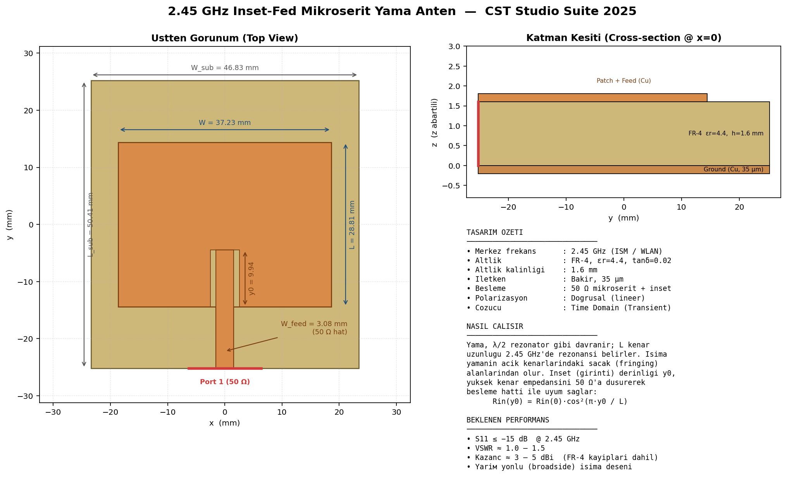

# 2.45 GHz Inset-Fed Mikroşerit Yama Anten — CST Studio Suite 2025

Bu klasör, **CST Studio Suite 2025** ortamında tek tıkla kurulan, tamamen
parametrik ve işlevsel bir **2.45 GHz girintili beslemeli (inset-fed)
mikroşerit yama anten** tasarımını içerir. Tasarım; WLAN / Bluetooth / ISM
bandı (2.4–2.4835 GHz) uygulamaları için optimize edilmiştir.

> Dosya: [`patch_antenna_2450MHz.bas`](./patch_antenna_2450MHz.bas) — CST VBA makrosu

---

## 0. Tasarımın Görünümü



> Görsel, makronun ürettiği geometriyle birebir aynı ölçülerdedir
> (`draw_antenna.py` ile üretilir).

### Anten nasıl çalışır?

Mikroşerit yama, alt yüzeydeki kesintisiz toprak düzlemiyle birlikte bir
**yarım dalga (λ/2) rezonatör** gibi davranır:

- **Rezonans:** Yamanın `L` kenar uzunluğu 2.45 GHz'de rezonansı belirler.
  Elektrik alan, yamanın iki açık (ışıyan) kenarı arasında durağan dalga
  oluşturur.
- **Işıma:** Enerji, yamanın açık kenarlarındaki **saçak (fringing)**
  alanlarından serbest uzaya yayılır → yüzeye dik (broadside) yönlü ışıma.
- **Empedans uyumu (inset besleme):** Yama kenarındaki giriş direnci
  yüksektir (~200 Ω). Besleme hattını yamanın içine `y₀` kadar sokarak
  (girinti/inset) bu direnç 50 Ω'a düşürülür:
  ```
  R_in(y₀) = R_in(0) · cos²(π·y₀ / L)
  ```
  Böylece 50 Ω mikroşerit hat ile mükemmel uyum (düşük S₁₁) sağlanır.
- **Besleme:** 3.083 mm genişliğindeki mikroşerit hat tam 50 Ω karakteristik
  empedans sunar ve dalga kılavuzu portuyla uyarılır.

---

## 1. Tasarım Özeti

| Özellik | Değer |
|---|---|
| Merkez frekans (f₀) | **2.45 GHz** |
| Altlık (substrate) | FR-4, εᵣ = 4.4, tanδ = 0.02 |
| Altlık kalınlığı (h) | 1.6 mm |
| İletken | Bakır (σ = 5.8×10⁷ S/m, t = 35 µm) |
| Besleme | 50 Ω mikroşerit hat + inset geçiş |
| Polarizasyon | Doğrusal (lineer) |
| Çözücü | Time Domain (Transient), Hexahedral mesh |
| Beklenen kazanç | ~3–5 dBi (FR-4 kayıpları dahil) |
| Beklenen S₁₁ | ≤ −15 dB @ 2.45 GHz |

---

## 2. Hesaplanan Geometri (Analitik Başlangıç)

Boyutlar Balanis'in *Antenna Theory* mikroşerit yama denklemleriyle
hesaplanmıştır. Makro bu değerleri parametre olarak yükler:

| Parametre | Sembol | Değer | Açıklama |
|---|---|---|---|
| Yama genişliği | `W_patch` | **37.234 mm** | Işıma genişliği |
| Yama uzunluğu | `L_patch` | **28.809 mm** | Rezonans uzunluğu |
| Besleme hattı genişliği | `W_feed` | **3.083 mm** | 50 Ω empedans |
| Inset (girinti) derinliği | `y_inset` | **9.935 mm** | Empedans uyumu (≈ L/3) |
| Inset boşluk genişliği | `g_inset` | 1.0 mm | Hat–yama açıklığı |
| Besleme dış uzunluğu | `L_feed` | 12.0 mm | Porta kadar hat |
| Altlık genişliği | `W_sub` | W_patch + 6h | Kenar payı |
| Altlık uzunluğu | `L_sub` | L_patch + L_feed + 6h | Kenar payı |

### 2.1 Kullanılan Denklemler

**Yama genişliği:**

```
W = (c / 2f₀) · √(2 / (εᵣ + 1))
```

**Efektif dielektrik sabiti:**

```
ε_eff = (εᵣ+1)/2 + (εᵣ-1)/2 · [1 + 12h/W]^(-1/2)
```

**Kenar uzaması (fringing):**

```
ΔL = 0.412h · (ε_eff + 0.3)(W/h + 0.264) / [(ε_eff − 0.258)(W/h + 0.8)]
```

**Rezonans uzunluğu:**

```
L = c / (2f₀√ε_eff) − 2ΔL
```

**Inset besleme derinliği** (kenar direncini 50 Ω'a indirir):

```
R_in(y₀) = R_in(0) · cos²(π·y₀ / L)   →   y₀ ≈ L/3
```

---

## 3. Kurulum Adımları (CST Studio Suite 2025)

1. CST Studio Suite 2025'i açın → **New Template** →
   **Microwaves & RF / Optical → Antenna → Planar (Patch, Slot, …)** →
   `Time Domain` çözücüsünü seçin. (Veya boş bir 3D proje açabilirsiniz;
   makro tüm ayarları kendisi yapar.)
2. Üst şeritte **Home → Macros → Edit/Open Macros…** (kısayol `Alt+F11`).
3. `patch_antenna_2450MHz.bas` dosyasının **tüm içeriğini** kopyalayıp VBA
   editörüne yapıştırın → **Run (F5)**.
   - Alternatif: **Macros → Run Macro…** ile bu `.bas` dosyasını seçin.
4. Makro; geometriyi, malzemeleri, portu, açık sınır koşullarını, frekans
   aralığını (2–3 GHz) ve uzak alan monitörlerini otomatik kurar.
5. **Home → Start Simulation** ile çözümü başlatın (FR-4 üzerinde tipik
   çözüm süresi birkaç dakikadır).

---

## 4. Sonuçların İncelenmesi

Çözüm bitince **Navigation Tree** üzerinden:

- **1D Results → S-Parameters → S1,1**
  → Geri dönüş kaybı; 2.45 GHz'de derin bir çukur (≤ −15 dB) görmelisiniz.
- **1D Results → Port signals / VSWR**
  → 2.45 GHz'de VSWR ≈ 1.0–1.5.
- **Farfields → farfield_f0 (f=2.45)**
  → 3B ışıma diyagramı, **Gain (dBi)**, yön kazancı (directivity), HPBW.
- **Farfields → Polar Plot** → E-düzlem ve H-düzlem kesitleri.
- **2D/3D Results → h_field_f0** → yama üzerindeki yüzey akım dağılımı.

---

## 5. Akort / Optimizasyon (İnce Ayar)

Üretim toleransları ve FR-4 εᵣ değişkenliği nedeniyle rezonans birkaç
on MHz kayabilir. Hocanıza "canlı" optimizasyon göstermek için:

- **`L_patch`** → rezonans frekansını ayarlar
  (uzat → frekans düşer, kısalt → frekans yükselir).
- **`y_inset`** → giriş empedansını / S₁₁ derinliğini ayarlar.
- **Simulation → Parameter Sweep**: `L_patch` veya `y_inset` üzerinde
  süpürme tanımlayın.
- **Simulation → Optimizer**: Hedef `S1,1 < −20 dB @ 2.45 GHz` verip
  `L_patch`, `y_inset` parametrelerini otomatik optimize edin.

---

## 6. Daha "Gelişmiş" Göstermek İsterseniz (Opsiyonel)

- **Daha yüksek performans için altlık:** FR-4 yerine `Rogers RO4350B`
  (εᵣ = 3.66, tanδ = 0.0037) seçin → kazanç ve verim belirgin artar.
  Makroda `eps_r = 3.66`, `tand = 0.0037` yapıp boyutları yeniden
  hesaplamak yeterli.
- **Anten dizisi (array):** Tek yamayı 2×1 veya 2×2 dizilim yapıp güç
  bölücü (corporate feed) ekleyerek kazancı +3/+6 dB artırabilirsiniz.
- **Bant genişletme:** U-yarık (U-slot) veya parazitik yama ekleyin.

---

## 7. Dosya İçeriği

```
cst-antenna/
├── patch_antenna_2450MHz.bas   # CST 2025 VBA kurulum makrosu (parametrik)
└── README.md                   # Bu doküman
```

---

*Not: Boyutlar analitik denklemlerle hesaplanmış başlangıç değerleridir.
Tam dalga (full-wave) çözüm sonrası küçük bir ince ayar (≈ %1–2)
normaldir ve beklenir — bu, EM tasarım sürecinin standart bir parçasıdır.*
